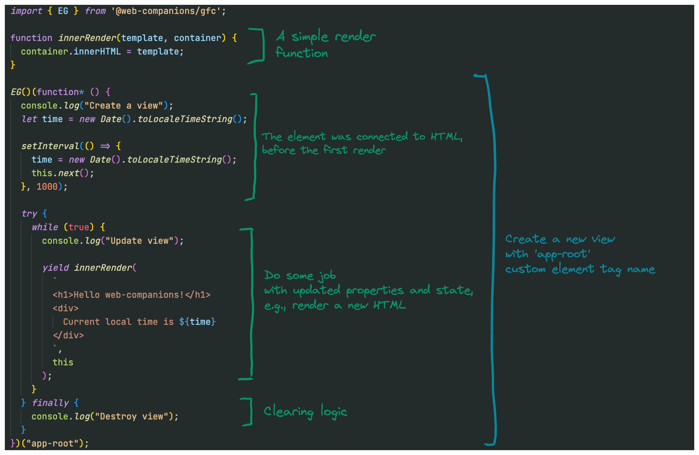

# `web-companions`

[](https://lerna.js.org/)

### 🧰 Tools to simplify web development process

The main purpose of this library is to make it easier to use Web Specifications and perform simple, straightforward tasks.

1. Write native UI components in a clear way.
2. No extra knowledge. Learn language, learn specifications and platforms.
3. Without frameworks with minimum of dependencies.

## Use cases

1. Create a simple view:
[demo](https://codesandbox.io/s/web-companions-create-a-simple-view-xhxm3h?file=/src/index.js)

```js
import { EG } from '@web-companions/gfc';

function innerRender(template, container) {
  container.innerHTML = template;
}

EG()(function* () {
  console.log("Create a view");
  let time = new Date().toLocaleTimeString();

  setInterval(() => {
    time = new Date().toLocaleTimeString();
    this.next();
  }, 1000);

  try {
    while (true) {
      console.log("Update view");

      yield innerRender(
        `
        <h1>Hello web-companions!</h1>
        <div>
          Current local time is ${time}
        </div>
        `,
        this
      );
    }
  } finally {
    console.log("Destroy view");
  }
})("app-root");
```

## Theory

In general, any UI component has two things:
1. Lifecycle – to control how a component will be created, updated and destroyed.
2. Render – to visually present a component in a platform, for web it will be HTML, CSS, SVG.

```
<UI Component> = <Lifecycle> + <Render>;

// where:

<Lifecycle> = @web-companions/gfc;

<Render> =  lit-html | uhtml | hyperHTML | @github/jtml | <any other, even innerHTML if you need something very simple>;
```

<!-- So, you can always write your oun Render or you one of already exist:
- `@web-companions/lit` - lit-html render -->

To simplify the development process and increase DX we combined Lifecycle and Render inside `view`. A `view` could be rendered as an HTML element or an HTML node inside an element in a web page. Any `view` is building on two parts: lifecycle and render. In turn, the lifecycle is built on [Generator](https://developer.mozilla.org/en-US/docs/Web/JavaScript/Reference/Global_Objects/Generator) and [Custom elements](https://developer.mozilla.org/en-US/docs/Web/API/Web_components#custom_elements_2). That's all!


Provided Views:
1. @web-companions/lit - a view with lit-html render;


### More details

To use lifecycle convenient way, it was wrapped inside `@web-companions/gfc` package. So that we can just write a generator function for `EG` or `NG` functions, that will use it inside a custom element. Generator function in JS is a function that can run it part and return values several times without rerun the whole function. We create an infinity part that render a new HTML with updated values each time when we produce them.



No magic, no compilations, no hacks and hooks.As you can see, it's easy to repeat these libraries using JavaScript generator functions and Web Specifications.

---

## List of packages

<table>
   <tr>
    <th>Name</th>
    <th>Description</th>
   </tr>
  <tr>
    <td> <a href="https://github.com/sumbad/web-companions/tree/master/packages/gfc">@web-companions/gfc</a></td>
    <td><b>Generator Functional Components</b> - a library for making simple UI components based on the Web standards. It's a wrapper for creating Web Components using <a href="https://developer.mozilla.org/en-US/docs/Web/JavaScript/Reference/Statements/function*">JS Generator</a> functions</td>
  </tr>
  <tr>
    <td> <a href="https://github.com/sumbad/web-companions/tree/master/packages/lit">@web-companions/lit</a></td>
    <td>A <code>gfc</code> preset for creating element and node Views with <a href="https://lit.dev/docs/libraries/standalone-templates">lit-html</a> render</td>
  </tr>
  <tr>
    <td> <a href="https://github.com/sumbad/web-companions/tree/master/packages/react-adapter">@web-companions/react-adapter</a></td>
    <td>Create adapters over any Custom Element to use it with React.js component</td>
  </tr>
  <tr>
    <td> <a href="https://github.com/sumbad/web-companions/tree/master/packages/h">@web-companions/h</a></td>
    <td>Helper functions: 
        <ul>
            <li><code>setStyle</code> - Add or update a DOM element style</li>
            <li><code>instantMapper</code> - A simple mapper function for EG (gfc, lit). It will update a component's property immediately without waiting other changes</li>
        </ul>
    </td>
  </tr>
</table>

> MIT License
